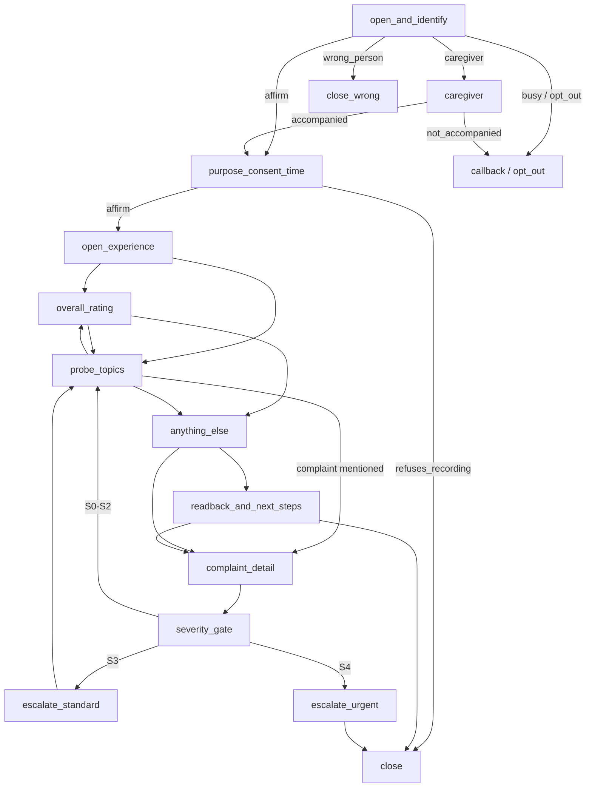

# Patient Feedback Voice Agent (PFA)

A multilingual (English + Hindi + Hinglish) patient-listening system for Indian hospitals. See
[`CLAUDE.md`](CLAUDE.md) and [`docs/`](docs/) for the full product/architecture spec.

This README covers the **Demo MVP**: a browser-based, no-login voice feedback conversation you can
run yourself in Chrome to try the product end to end. It now runs on the **node-graph conversation
engine** (PRD v2 — see `docs/PRD_V2_FINAL_REPORT.md` for the full report): a fixed set of
conversation states with deterministic code owning every transition, consent check, and safety
escalation; the LLM only proposes within a node, never decides on its own (CLAUDE.md rule 3). The
full telephony/production system (Sprints 1–8, [`docs/11_BUILD_PLAN.md`](docs/11_BUILD_PLAN.md)) is
being built alongside it.

## Prerequisites

- Docker Desktop
- A Gemini and/or OpenAI API key (get one yourself — this app never asks you to paste a key into
  chat with an AI assistant; you enter it directly into the app's own Settings page)

## 1. Start the stack

```bash
cp .env.example .env
```

Open `.env` and set:

```
DEMO_MODE=true
```

(`DEMO_MODE` defaults to `false` and is refused outright if `APP_ENV=production` — it's meant for
your own machine only.)

```bash
make up
```

This starts Postgres, Redis, the API, worker, beat, agent, dashboard, Mailpit, MinIO, and
LiveKit. First boot takes a few minutes while images build.

```bash
make migrate
```

## 2. Open the demo

Go to **http://localhost:3000/demo**.

### Configure a provider

Click **Settings**. For Gemini and/or OpenAI:

1. Paste your API key into the field for that provider.
2. Pick a model from the dropdown.
3. Click **Save & Test** — this makes one real call to the provider to confirm the key actually
   works, and only then marks it "Connected". A key that's saved but fails validation shows
   "Invalid" (bad key) or "Error" (something else went wrong) — either way it's never silently
   treated as working.

Your key is encrypted before it's stored and is never shown again, logged, or sent back to the
browser in full — only a status (Connected/Invalid/Error) and the model name.

While you're on the Settings page, also set the **hospital name**, **agent name**, and **agent
voice** (female/male) for the demo. The page tells you if your browser doesn't have a matching
voice for the language + gender you picked (common for male Hindi voices) — it'll fall back to the
closest one available rather than fail.

### Start a call

Fill in the patient/visit form (name, phone, visit type, date, department, doctor) and click
**Start Demo Call** — or, if you've already run a CSV ingestion (Sprint 1), use the **"start from an
already-ingested visit"** card instead and paste a `visit_id`; this reuses that visit's existing
`Patient`/`Visit` rows rather than creating new ones, and correctly computes the next call attempt
number. Allow microphone access when Chrome asks. Reply out loud, or type in the text box if you'd
rather not use the mic (or if speech recognition isn't available) — both go through the exact same
backend conversation engine.

A short script to try the conversation graph end to end:

1. Confirm your identity ("haan main hi bol raha hoon") — the agent asks consent to record before
   any survey question.
2. Give consent, then describe the visit. Rate it, mention one thing that could be better, then say
   there's nothing else.
3. The agent reads back a summary and closes — no review/referral ask, ever (CLAUDE.md rule 5).

Other paths worth trying: say "mujhe insaan se baat karni hai" (routes straight to a callback,
bypassing the LLM entirely — a deterministic policy check, not an LLM classification); say you're
someone else's caregiver ("main beta hoon unka") to see the proxy-respondent path; or mention a
safety keyword (e.g. "seene mein dard ho raha hai" — chest pain) to see the safety-escalation script
fire immediately, skipping the LLM call entirely for latency.

The call closes itself once the interview is complete (or after 20 agent turns regardless, as a
hard ceiling) — you don't need to do anything to end it, though an **End Call** button is there too.

### Results & escalations

**Results** (`/demo/results`) lists every finished call — outcome, rating, complaint count, max
severity — with a detail page per call and a CSV export. **Escalations** (`/demo/escalations`) is
the queue of `PfaEscalation` rows a safety-triggered or S3+ complaint produces, with an acknowledge
action.

### Debug a call

Every call has a **Debug** link (top right once a call is running) showing the full event
timeline: node transitions, guard events, safety triggers, provider/model, locked language, and
every step with its input/output/timestamps. If a step fails, it shows up in red so it's obvious
what broke.

## The conversation graph

Fixed nodes, deterministic edges (`backend/app/domain/conversation_graph/graph.py`). The LLM
proposes a `proposed_next` node each turn; `graph.next_node()` only accepts it if it's a legal edge
from the current node — an illegal (e.g. hallucinated) proposal is rejected and logged, and the call
just stays on its current node instead of breaking.



A safety-lexicon hit on the patient's raw text, or the LLM's own `safety.flag`, escalates to
`escalate_urgent` from **any** node — that's a global interrupt (PRD §7.2), not a graph edge, which
is why it isn't drawn as one above. Policy pre-checks (opt-out / wants-human / repeat-request) work
the same way: they're matched on the raw text before the node LLM is even called, from any node.

## How to add a scenario

Scenarios live in `backend/tests/scenarios/cases/*.yaml` and run as part of the regular suite
(`pytest tests/integration/test_scenario_harness.py`) using a deterministic mock LLM — no API key
needed. To add one:

1. Copy an existing case close to what you want (e.g. `S17.yaml` for a simple complaint, `S26.yaml`
   for a safety escalation) and give it a new `id`.
2. Write the `turns` list: each turn is the patient's actual text (which real policy/safety checks
   run against) plus an optional `contract` — the canned `NodeContract` fields to hand back **only
   on turns where the engine actually calls the LLM**. Whether a turn calls the LLM depends on
   `pfa_call_service.process_turn`'s own short-circuits (a safety keyword hit, an opt-out/
   wants-human policy match, `event_kind: silence`/`stt_error`, or the deterministic
   `escalate_urgent` follow-up) — get this wrong and `mock_llm.ScenarioLLM` raises a clear error
   naming the mismatch rather than silently misbehaving.
3. Write an `expect` block (see `assertions.py` for every supported key: `outcome`, `final_node`,
   `rating`/`min_rating`, `complaint_count`/`min_complaint_count`, `escalation_count`/
   `min_escalation_count`, `severity_max`, `topic_count`/`min_topic_count`, `respondent_type`,
   `language_mode`).
4. Run `pytest tests/integration/test_scenario_harness.py -k <your id> -q` to check it.

To run a small sample against the **real** Gemini API instead (uses your saved Settings key):
`docker exec pfa-auth-check python -m tests.scenarios.runner --ids S01,S26,S36` — writes a report to
`backend/tests/scenarios/reports/`.

## How to edit the fixed scripts / safety lexicon

- **Fixed script lines** (consent line, escalation scripts, closing lines, etc. — anything the LLM
  never writes): `backend/app/domain/conversation_graph/assets/scripts.yaml`. Each key under
  `scripts` has a `roman` (Hinglish), `deva` (Devanagari), and `english` variant, plus gendered
  `{tokens}` resolved from `tokens` (e.g. `{bol_rahi}`). Restart `pfa-api-1` after editing —
  `prompts.py`'s loader is `@cache`d in-process.
- **Safety lexicon**: `backend/app/domain/conversation_graph/assets/safety_lexicon.yaml`. One
  category (`medical_now`, `self_harm`, `abuse`, `sexual_misconduct`, `privacy`, `discrimination`,
  `threat`, `medication_error`) → a list of regex alternations, matched case-insensitively with
  whitespace boundaries (not `\b`, which incorrectly splits Devanagari words ending in a matra).
  False positives are fine; false negatives aren't — prefer a broader pattern.
- **Per-node LLM prompts**: `backend/app/domain/conversation_graph/assets/node_prompts/*.md`, one
  per node the LLM actually reasons in (pure-FIXED nodes never call it). Each states the node's
  legal `proposed_next` values explicitly — the real Gemini API has hallucinated invalid node names
  live, so this isn't optional.

## Troubleshooting

- **A dashboard code change doesn't seem to show up.** Docker Desktop on Windows doesn't always
  forward file-change notifications across the bind-mounted `dashboard/` folder to the Next.js dev
  server. The dev server is configured to poll for changes (`dashboard/next.config.mjs`), which
  should cover this, but if you still don't see an update: `docker restart pfa-dashboard-1`.
- **Microphone doesn't work / permission denied.** Check Chrome's site settings for
  `localhost:3000` and allow the microphone, then reload. The text box always works as a fallback
  regardless.
- **"Not Configured" / "Invalid" won't go away.** The status only flips to "Connected" after a real
  test call to the provider succeeds — check the key, and check the model you picked is one your
  key actually has access to.
- **The whole `/demo` page 404s.** `DEMO_MODE` is off, or `APP_ENV=production`. Check `.env`.
- **Something crashed mid-call.** It shouldn't — LLM failures are caught, retried once, and fall
  back to a generic response so the call keeps going. Check the call's Debug page for the exact
  failed step; check `docker logs pfa-api-1` for anything unexpected.

## Full backend/dashboard development

```bash
make lint          # ruff + mypy --strict + eslint + tsc + import-linter
make test           # backend unit + integration (real Postgres via testcontainers)
make test-safety     # safety golden set (production call-flow only, not the demo)
```

See [`CLAUDE.md`](CLAUDE.md) for coding conventions, the full command list, and the non-negotiable
rules this codebase follows.
