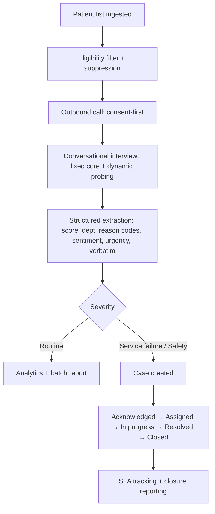

# 00 — Product Overview

> Source: "Patient Feedback Voice Agent — Product R&D Document v1.0 (2026-09-20)", restructured for
> implementation. Market figures are planning assumptions, not verified facts.

## 1. Positioning

**One line:** A multilingual, post-visit patient-listening and service-recovery system that turns every
completed call into a tracked, closeable action — not a survey score.

### 1.1 Anti-scope (what we are NOT)

| We are NOT | We ARE |
|---|---|
| An NPS/CSAT form with a voice skin | A conversational interviewer that probes *why* |
| An IVR tree ("press 1 for good") | Free-form dialogue with structured extraction |
| A dashboard of falling scores | A workflow: complaint acknowledged → assigned → resolved → closed |
| A review/reputation generator | An internal operational quality instrument |
| A clinical or triage assistant | A service-experience listener that escalates clinical concerns to humans immediately |

### 1.2 The core loop

**Investment rule:** when choosing where to spend effort, the right-hand branch (cases, SLA, closure)
wins over the left (analytics).

## 2. Where we must win (feature tie-breaker)

Build priority goes to capabilities marked **win**. Two losses are accepted on purpose.

| Capability | Us | Note |
|---|---|---|
| Free-form multi-turn conversation | **win** | Competitors are forms or IVR |
| Dynamic probing on negatives | **win** | One focused probe per negative, capped |
| Hindi–English code-switch handling | **win** | Mid-sentence mixing, no restart |
| Real-time severity branching | **win** | Safety tier escalates within the call |
| Closed-loop escalation with SLA | **win** | The product |
| India hosting / DPDP-native controls | **win** | Compliance as features |
| Vendor-swappable architecture | **win** | Adapters |
| Verbatim transcript as audit evidence | parity | Every complaint has one |
| Department/doctor reporting | parity | |
| Enterprise benchmark datasets | accept loss | Phase 3 at earliest |
| HCAHPS/CAHPS frameworks | accept loss | Not for Indian mid-market |

## 3. Beachhead (MVP supports this and nothing more)

| Dimension | MVP value |
|---|---|
| Geography | Bengaluru, Hyderabad, Mumbai, Delhi NCR, Pune, Chennai, Ahmedabad |
| Facilities | Private hospitals (50+ beds), diagnostic/clinic chains |
| Volume | 100–500 eligible post-visit calls/day per account |
| Languages | English + Hindi + one regional language per pilot (pluggable slot) |
| Visit types | `outpatient`, `diagnostic` only |
| Sponsor | Quality / patient-relations / operations head |

**Out of MVP:** all other Indian languages, inpatient discharge, deep EMR/FHIR integration,
public-sector procurement.

Volume reality: only **20–50%** of visits become eligible calls after exclusions. The eligibility engine
is a first-class component and its suppression report is a sales asset.

## 4. Users — do not conflate

| User | Touchpoint | Job to be done | Design priority |
|---|---|---|---|
| Patient | Phone call | "Be heard quickly, in my language, without being sold to" | Brevity, clarity, respect, easy exit |
| Quality / patient-relations officer | Escalation queue | "Know which complaints need me today, and prove I closed them" | Triage speed, evidence, SLA visibility |
| Administrator / COO | Dashboard + reports | "Show me where service is failing and whether it improved" | Trends, department comparison, closure rate |

**Buyer vs user:** the person with the pain (quality) rarely approves the purchase (IT/procurement). So:
- The product must be demo-able to a quality head in 10 minutes (seeded demo account, doc 10).
- The product must survive an IT security review (doc 07).

**Sales cycle implication:** a pilot must stand up in days → CSV/SFTP ingestion before API integration.

## 5. Phases

### Phase 1 — MVP (build now)
1. Secure patient-list ingestion (SFTP CSV + manual upload)
2. Eligibility filtering, dedupe, number validation, DND/opt-out suppression
3. Outbound call orchestration: retry policy, contact window, concurrency cap
4. Deterministic consent & recording disclosure
5. Language selection + Hindi/English code-switch
6. Deterministic survey state machine
7. LLM-assisted probing on negatives
8. Structured extraction with verbatim evidence
9. Safety boundary: clinical refusal + emergency escalation
10. Escalation queue with lifecycle + SLA timers
11. Dashboard (8 views) + email push
12. Audit trail, retention, deletion workflow
13. Per-call cost telemetry

### Phase 2 — after Phase 1 acceptance (outline only)
API/webhook ingestion · more regional languages with per-language STT routing · multi-location RBAC ·
SSO (SAML/OIDC) + audit export · taxonomy suggestions/theme clustering · callback scheduling with
preferred-time learning · longitudinal analytics · India-region/BYOC · WhatsApp/SMS fallback.

### Phase 3 — after two paid renewals (outline only)
FHIR/ABDM exchange · no-code policy console · in-house language eval datasets · outcome analytics ·
anonymised benchmarks · other-vertical variant · predictive complaint-risk scoring.

## 6. Success metrics

- **North star:** actionable insight per eligible patient (not calls completed).
- **Safety metric (asymmetric):** urgency recall on safety concerns. Target: zero missed safety
  escalations in pilot; tune thresholds toward over-escalation.
- **Pilot ROI (prove ≥ 2, against the account's own baseline):** 2–4× more completed feedback than
  SMS/forms · 30–50% less manual calling · faster acknowledgement of serious complaints · more
  department-level actionable insight · 10–20%+ faster complaint closure · positive contribution margin.

## 7. Commercial constraints that shape the build

- Pricing is hybrid: platform fee + included completed calls/minutes + overage. **Never bill per attempt.**
  → the system must distinguish attempts vs answered vs completed precisely.
- Target direct cost per completed ~5-min call: **₹4.50–24**. → cost telemetry per call, deterministic
  turns wherever possible, cached TTS, LLM only where needed.
- NRR > 100% comes from more departments, languages, locations → these are configuration surfaces
  from day one (per-account, per-location, per-department config).
- Pilot precondition: a **named escalation owner**. The product enforces this: an account cannot move to
  `live` status without at least one active user with role `quality` assigned as default case owner.
