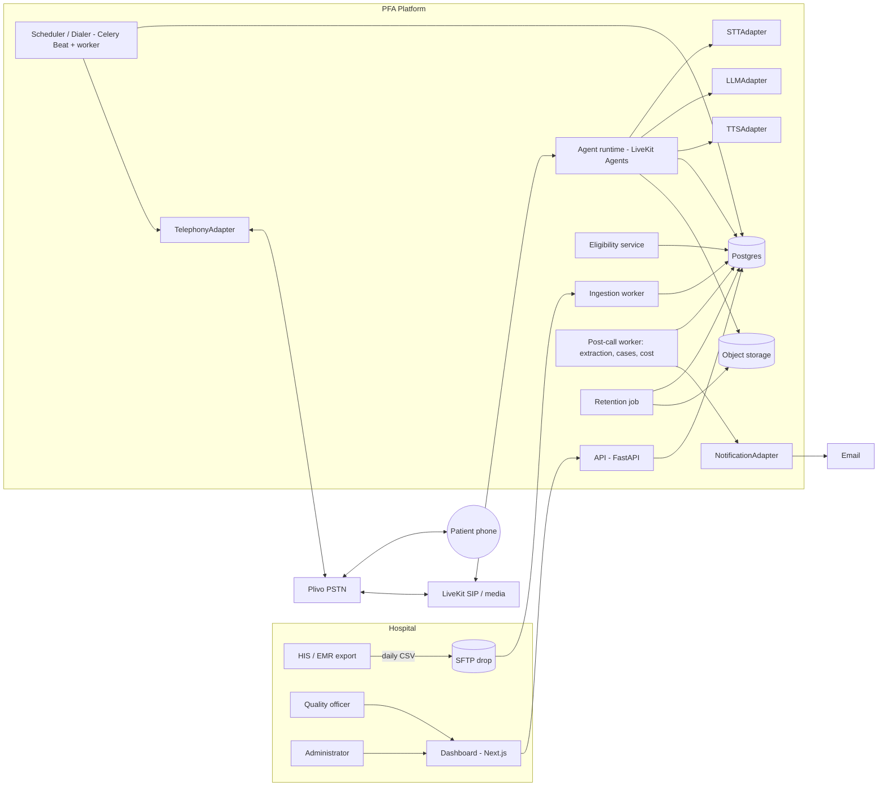
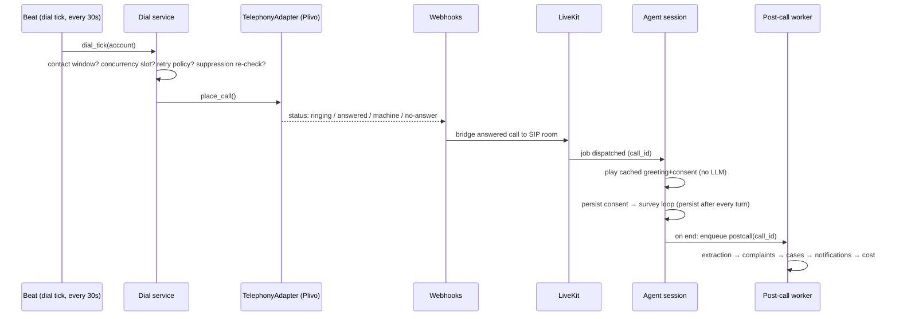

# 01 — Architecture

## 1. System context



## 2. Services (processes)

| Process | Tech | Responsibility | Scales by |
|---|---|---|---|
| `api` | FastAPI (uvicorn) | Dashboard + admin REST, Plivo webhooks, auth | Replicas behind LB |
| `worker` | Celery | Ingestion, eligibility, dial jobs, post-call extraction, case notifications, SLA checks, retention purge, deletion | Queue-specific worker pools |
| `beat` | Celery Beat | Schedules: SFTP poll, dial ticks, SLA ticks, digests, retention | Single instance (leader) |
| `agent` | LiveKit Agents worker | Runs one call session per job: consent, state machine, STT/LLM/TTS loop, persistence per turn | Agent servers (≈10–25 concurrent jobs / 4 vCPU, 8 GB) |
| `dashboard` | Next.js | UI | Replicas |
| `postgres` | PG 16 | System of record | Vertical, then read replica |
| `redis` | Redis 7 | Broker, locks, rate limits, concurrency counters, prompt audio cache index | Single + replica |

Celery queues: `ingest`, `dial` (high priority, low latency), `postcall`, `notify`, `maintenance`.

## 3. Repository tree

```
backend/
  pyproject.toml
  app/
    main.py                         # FastAPI app factory
    core/
      config.py                     # Settings (pydantic-settings)
      logging.py                    # structlog + redaction processor
      errors.py                     # PFAError hierarchy + codes (doc 06)
      security.py                   # hashing, encryption helpers, JWT
      ids.py                        # uuid7 + prefixed ids
      clock.py                      # injectable clock (tests freeze time)
      phone.py                      # E.164 normalisation, hashing
    domain/                         # PURE — no I/O, no vendor imports
      eligibility.py                # rules → EligibilityDecision
      contact_window.py             # is_dialable(now, account) etc.
      retry_policy.py
      consent.py                    # consent state machine
      call_state_machine.py         # survey flow states/transitions
      answer_tracking.py            # answered_fields, probe caps
      safety.py                     # deterministic safety + clinical detectors
      urgency.py                    # tier resolution (LLM suggestion + rules)
      escalation.py                 # complaint → case decision
      case_lifecycle.py             # allowed transitions, guards
      sla.py                        # due dates, breach calc
      taxonomy.py                   # reason codes, defaults
      cost.py                       # cost model
    adapters/
      interfaces.py                 # Protocols (below)
      registry.py                   # choose adapter by config/language
      plivo/telephony.py
      deepgram/stt.py
      gemini/llm.py
      cartesia/tts.py
      email/smtp.py
      storage/s3.py
      fakes/                        # deterministic fakes for tests & local dev
    services/
      ingestion_service.py
      eligibility_service.py
      dial_service.py
      call_session_service.py       # persistence of per-turn state
      extraction_service.py
      case_service.py
      notification_service.py
      retention_service.py
      deletion_service.py
      cost_service.py
      audit_service.py
      metrics_service.py
    agent/
      entrypoint.py                 # LiveKit worker entry
      session.py                    # CallSession orchestrates one call
      turn_loop.py                  # STT final → decide → speak
      barge_in.py
      prompt_audio.py               # cached pre-rendered clips
    api/v1/
      auth.py accounts.py locations.py users.py ingestion.py visits.py
      calls.py cases.py dashboard.py suppression.py deletion.py audit.py
      webhooks_plivo.py health.py
    db/
      base.py models/*.py repositories/*.py
      alembic/ versions/
    workers/
      celery_app.py tasks/*.py beat_schedule.py
    prompts/
      v1/interpret_answer.yaml probe_decision.yaml probe_generate.yaml
         extract_call.yaml summarise.yaml paraphrase.yaml
      schemas/*.json
    audio/
      manifest.yaml                 # static utterances per language/voice
  tests/ (see doc 08)
dashboard/
  src/app/(auth)/login  src/app/(app)/cases  .../calls .../departments .../doctors
  .../locations .../operations .../data-quality .../settings
  src/components/ src/lib/api.ts src/i18n/en.json
eval/
  latency/  audio_fixtures_8k/  safety_golden/  stt_wer/
infra/
  docker-compose.yml  docker/*.Dockerfile  .github/workflows/*.yml
```

## 4. Adapter interfaces (exact contracts)

All in `backend/app/adapters/interfaces.py`. Business code depends only on these Protocols.
Every adapter method: has a timeout, raises only `AdapterError` subclasses (doc 06), and emits a
`adapter.call` event with latency + cost units.

```python
from typing import Protocol, AsyncIterator, Literal
from dataclasses import dataclass
from datetime import datetime

# ---------- Telephony ----------
@dataclass(frozen=True)
class PlaceCallRequest:
    call_id: str
    to_e164: str
    from_cli: str                 # registered caller ID
    answer_url: str               # our webhook
    status_callback_url: str
    machine_detection: bool = True
    ring_timeout_s: int = 30

@dataclass(frozen=True)
class PlaceCallResult:
    provider_call_id: str
    accepted_at: datetime

class TelephonyAdapter(Protocol):
    async def place_call(self, req: PlaceCallRequest) -> PlaceCallResult: ...
    async def hangup(self, provider_call_id: str) -> None: ...
    async def transfer(self, provider_call_id: str, to_e164: str) -> None: ...
    async def bridge_to_media(self, provider_call_id: str, sip_uri: str) -> None: ...
    def parse_status_webhook(self, payload: dict, headers: dict) -> "CallStatusEvent": ...
    def verify_webhook_signature(self, payload: bytes, headers: dict, url: str) -> bool: ...

# ---------- STT ----------
@dataclass(frozen=True)
class Transcript:
    text: str
    is_final: bool
    confidence: float             # 0..1
    language: str | None          # "en", "hi", "hi-en", ...
    start_ms: int
    end_ms: int

class STTStream(Protocol):
    async def push_audio(self, pcm16_8k: bytes) -> None: ...
    def results(self) -> AsyncIterator[Transcript]: ...
    async def close(self) -> None: ...

class STTAdapter(Protocol):
    async def stream_open(self, languages: list[str], sample_rate: int = 8000,
                          keywords: list[str] | None = None) -> STTStream: ...

# ---------- LLM ----------
@dataclass(frozen=True)
class LLMResult:
    data: dict                    # validated against the prompt's JSON schema
    raw_text: str
    input_tokens: int
    output_tokens: int
    model: str
    latency_ms: int

class LLMAdapter(Protocol):
    async def complete(self, prompt_id: str, variables: dict, *, timeout_s: float) -> LLMResult: ...
    async def classify(self, prompt_id: str, variables: dict, *, timeout_s: float) -> LLMResult: ...
    async def extract(self, prompt_id: str, variables: dict, *, timeout_s: float) -> LLMResult: ...
    async def summarise(self, prompt_id: str, variables: dict, *, timeout_s: float) -> LLMResult: ...

# ---------- TTS ----------
class TTSAdapter(Protocol):
    def synthesise_stream(self, text: str, language: str, voice_id: str,
                          speaking_rate: float = 1.0) -> AsyncIterator[bytes]: ...
    async def synthesise_cached(self, clip_key: str) -> bytes: ...   # pre-rendered clip

# ---------- Notifications ----------
class NotificationAdapter(Protocol):
    async def send_email(self, to: list[str], subject: str, html: str, text: str,
                         idempotency_key: str) -> str: ...
    async def send_webhook(self, url: str, payload: dict, secret: str,
                           idempotency_key: str) -> int: ...
    async def send_message(self, channel: Literal["sms", "whatsapp"], to_e164: str,
                           template_id: str, variables: dict) -> str: ...   # Phase 2

# ---------- Storage ----------
class ObjectStorageAdapter(Protocol):
    async def put(self, key: str, data: bytes, content_type: str, retention_until: datetime) -> str: ...
    async def signed_get_url(self, key: str, ttl_s: int = 300) -> str: ...
    async def delete(self, key: str) -> None: ...
```

### 4.1 Adapter registry & language routing

`adapters/registry.py` resolves an adapter by `(capability, language, account)` from config:

```yaml
stt_routing:
  default: deepgram
  by_language:
    en: deepgram
    hi: deepgram
    hi-en: deepgram
    # regional slot filled per pilot, e.g.:
    # ta: <provider>   (Phase 2 routing; hook exists in MVP)
  low_confidence_threshold: 0.55   # below → flag call for human review
```

The hook exists in MVP even though only Deepgram is wired. Adding a provider = new adapter folder +
registry entry, zero domain changes.

## 5. Call runtime sequence



**Final pre-dial check** (inside a DB transaction with a row lock on the call): the dial service
re-evaluates suppression, opt-out, contact window, and per-patient frequency immediately before
`place_call`, because lists can change between queueing and dialing.

## 6. Concurrency control

- Per-account concurrency cap stored in `accounts.max_concurrent_calls`.
- Redis semaphore `conc:{account_id}` (INCR with TTL lease, released on call end/webhook; a reaper task
  fixes leaked leases every 60 s by reconciling with `calls` in `dialing|answered|in_progress`).
- Global platform cap `PLATFORM_MAX_CONCURRENT_CALLS` protects agent capacity.
- Sizing: `concurrency ≈ calls_per_hour × avg_call_minutes / 60`; provision **2× peak** (doc 10).

## 7. Session state persistence

The agent persists `call_state` (see doc 03 §6) to Postgres **after every turn** in a single upsert. The
LLM never receives the full history as the source of truth; it receives a compact state snapshot + last
2 turns. If an agent process crashes, the call is ended politely by LiveKit disconnect handling, the
call is marked `failed_system`, and partial data is still extracted.

## 8. Latency budget (per turn, target P50)

| Segment | Budget |
|---|---|
| End-of-speech detection (VAD/endpointing) | 300–500 ms |
| STT final | 150–300 ms |
| Deterministic decision | < 20 ms |
| LLM (only when needed) | 300–700 ms |
| TTS first audio chunk | 150–300 ms |
| Network/media | 100–200 ms |
| **Response start** | **< 1.2–1.8 s** |

Techniques: cached clips for static utterances, streaming TTS, start TTS on first LLM sentence, skip
LLM on deterministic turns (target 70–90% of routine turns), filler-free (no "hmm" hacks).

## 9. Architecture Decision Records

Create `docs/adr/0001-stack.md`, `0002-adapter-pattern.md`, `0003-deterministic-safety.md`,
`0004-celery-over-alternatives.md` in Sprint 0 summarising the reasons above.
