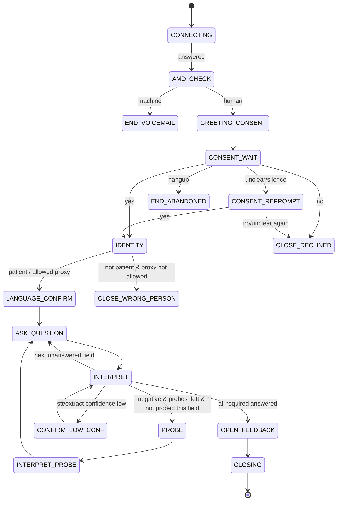

# 03 — Call Flow & Conversation Design

Principle: **a finite-state workflow with LLM flexibility — not an unconstrained chatbot.**

| State machine owns (deterministic) | LLM owns (bounded) |
|---|---|
| Which question comes next | Natural paraphrase of the current question |
| Whether required fields are complete | Interpreting a free-form answer into structured values |
| When the call ends | Deciding whether a negative answer deserves one probe |
| Consent, opt-out, emergency, escalation | Generating that single probe |
| Retries, reprompts, language switch trigger | Post-call extraction + summary |

---

## 1. Pre-call: eligibility engine (`domain/eligibility.py`)

Pure function: `evaluate(visit, patient, context) -> EligibilityDecision(status, reason)`.
Rules run **in this order**; the first failing rule sets the reason (so reports are stable).

| # | Rule | Result | Reason |
|---|---|---|---|
| 1 | Patient soft-deleted | suppressed | `deleted_patient` |
| 2 | `visit_type` not in {outpatient, diagnostic} | suppressed | `out_of_scope_visit_type` |
| 3 | `patient_age < 18` | suppressed | `minor` |
| 4 | Phone not valid E.164 / not an Indian mobile or permitted landline pattern | suppressed | `invalid_number` |
| 5 | `phone_hash` on account or platform opt-out | suppressed | `opt_out` |
| 6 | `phone_hash` on DND/NCPR list for this `campaign_type` | suppressed | `dnd` |
| 7 | Visit older than `recency_window_hours` at evaluation time | suppressed | `stale_visit` |
| 8 | Same patient has another visit within `dedupe_window_days` already eligible/called | suppressed (collapsed) | `duplicate_encounter` |
| 9 | This visit already has a completed/declined call | suppressed | `already_called_visit` |
| 10 | Patient called ≥ `frequency_cap_count` times in `frequency_cap_days` | suppressed | `frequency_cap` |
| 11 | Same phone appears > `shared_number_threshold` times in batch | review | `shared_number_review` |
| — | Otherwise | eligible | — |

Notes:
- DND for `service_feedback`: apply per legal classification (OPEN QUESTION #3). Until counsel answers,
  **suppress DND numbers for all campaign types** (safe default, flag `DND_STRICT=true`).
- Collapsing duplicates keeps the **most recent** visit; if equal dates, the one with a doctor name.
- Every decision writes `eligibility_status`, `suppression_reason`, `eligibility_evaluated_at`.
- Property-based tests (hypothesis) cover rule ordering and idempotence (doc 08).

## 2. Dial policy (`domain/contact_window.py`, `domain/retry_policy.py`)

```
is_dialable(now_utc, account, location) :=
    local = now_utc in (location.timezone or account.timezone)
    local.weekday in account.contact_days
    and local.date not in account.holidays
    and account.contact_window_start <= local.time < (account.contact_window_end - 8 min)
      # 8-min guard so a call never runs past window end
    and account.status == 'live'
```

Retry policy:

| Outcome of attempt | Retry? | Earliest next attempt |
|---|---|---|
| `no_answer`, `busy` | yes, if attempt_no < 3 | +4 h, and not in the same clock hour as any earlier attempt |
| `voicemail` (machine detected) | yes, **once only** across the visit | +4 h |
| `failed_telephony` (drop before answer) | yes, once | +4 h |
| dropped mid-call after consent (`partial`) | yes, **exactly one** retry, resumes at first unanswered field | +4 h, or patient-requested time |
| `abandoned_pre_consent` | no | — |
| `consent_declined` | no (visit suppressed) | — |
| `completed` | no | — |
| callback requested | scheduled callback replaces retry (counts as attempt) | patient-chosen slot within window |

If the next attempt would fall outside the window or after recency window (+24 h grace), the visit ends
as `exhausted` (no more calls).

## 3. In-call state machine (`domain/call_state_machine.py`)



**Global interrupts** — checked on *every* patient utterance **before** normal routing, in this priority:

| Priority | Detector | Target state | Notes |
|---|---|---|---|
| 1 | Emergency / distress (deterministic rules, LLM hint may add) | `SAFETY_ESCALATION` | Stops survey permanently |
| 2 | Opt-out ("don't call me again", "मुझे दोबारा कॉल मत करना") | `OPT_OUT_CLOSE` | Suppress permanently |
| 3 | Stop / hang up request ("stop", "बंद करो", "not interested") | `STOP_CLOSE` | Polite close |
| 4 | Recording withdrawal ("don't record", "रिकॉर्ड मत करो") | `RECORDING_WITHDRAWN` | Stop recording, offer continue/end |
| 5 | Clinical question (symptom, medicine, report meaning) | `CLINICAL_BOUNDARY` | Then resume |
| 6 | Busy ("I'm driving", "अभी बिज़ी हूँ") | `CALLBACK_OFFER` | |
| 7 | Language switch (detected language ≠ active, and supported) | switch `active_language`, re-ask current question | no restart |
| 8 | Confusion ("what?", "samajh nahi aaya") | `CLARIFY` (once per field) | 2nd → offer human callback |

Hard limits per call: max duration **8 min** (at 7 min → move to CLOSING), max probes **3**, max
reprompts per field **1**, max consecutive misunderstandings **2** → language offer → human callback.

## 4. Scripts (static, pre-rendered, never LLM-generated)

Variables in `{}` are filled from account config and rendered **at campaign setup**, then cached as
audio per account (`audio/manifest.yaml`). `{visit_when}` is "yesterday" / "on Monday" — computed.

### 4.1 Greeting + consent (order is mandatory: who → why → recording → right to stop → ask)

**EN**
> Namaste. This is an automated call from {hospital}, about your recent visit. We'd like to ask a few
> short questions to improve our services. This call may be recorded and transcribed. You can say no,
> or stop at any time. Shall we continue?

**HI**
> नमस्ते। यह {hospital} की ओर से एक ऑटोमेटेड कॉल है, आपकी हाल की विज़िट के बारे में। हम अपनी सेवाएँ
> बेहतर बनाने के लिए कुछ छोटे सवाल पूछना चाहते हैं। यह कॉल रिकॉर्ड और ट्रांसक्राइब की जा सकती है। आप
> कभी भी मना कर सकते हैं या कॉल रोक सकते हैं। क्या हम आगे बढ़ें?

Default opening language = `preferred_language` if set, else account's first language. The consent
clip ends with a short bilingual tail when language is unknown: "…Shall we continue? / क्या हम आगे बढ़ें?"

**Consent interpretation is deterministic** (`domain/consent.py`): phrase lists per language
(yes: "yes, haan, ha, ji, ok, theek hai, chalo, boliye, हाँ, जी, ठीक है…"; no: "no, nahi, नहीं, mat,
not now, busy…"). Ambiguous → one reprompt:

- EN: "Sorry, I didn't catch that. Is it okay to continue? Please say yes or no."
- HI: "माफ़ कीजिए, मैं समझ नहीं पाया। क्या हम आगे बढ़ें? कृपया हाँ या नहीं बोलिए।"

Still ambiguous → treat as **declined** (safe default). The LLM is not consulted for consent.

On `yes`: persist `consent_state=granted`, `consent_at=now()` → **commit** → only then continue.

### 4.2 Identity

- EN: "Am I speaking with the person who visited {hospital} recently?"
- HI: "क्या मेरी बात उसी व्यक्ति से हो रही है जो हाल ही में {hospital} आए थे?"

| Answer | `allow_proxy_feedback` | Action |
|---|---|---|
| Yes | — | `respondent=patient` |
| "I'm their son/wife…", can speak about visit | true | `respondent=proxy`, continue |
| Same | false | CLOSE_WRONG_PERSON |
| Wrong number | — | CLOSE_WRONG_NUMBER, flag number invalid for patient |

No visit details (department, doctor) are spoken before identity is confirmed.

### 4.3 Closings

| Close | EN | HI |
|---|---|---|
| Declined | "No problem. Thank you for your time. Goodbye." | "कोई बात नहीं। आपके समय के लिए धन्यवाद। नमस्ते।" |
| Wrong person | "Sorry to disturb you. Thank you, goodbye." | "परेशान करने के लिए माफ़ी। धन्यवाद, नमस्ते।" |
| Wrong number | "Sorry, we seem to have the wrong number. We won't call again. Goodbye." | "माफ़ कीजिए, शायद नंबर गलत है। हम दोबारा कॉल नहीं करेंगे। नमस्ते।" |
| Opt-out | "Understood. We won't call you again for feedback. Thank you, goodbye." | "समझ गया। हम आपको फ़ीडबैक के लिए दोबारा कॉल नहीं करेंगे। धन्यवाद, नमस्ते।" |
| Stop | "Of course. Thank you for your time. Goodbye." | "ज़रूर। आपके समय के लिए धन्यवाद। नमस्ते।" |
| Completed, nothing escalated | "Thank you for sharing your feedback. It helps us improve. Have a good day." | "फ़ीडबैक देने के लिए धन्यवाद। इससे हमें बेहतर होने में मदद मिलती है। आपका दिन शुभ हो।" |
| Completed, case created | "Thank you. I've passed your concern about {topic} to our patient-relations team. Someone from the hospital will look into it{, and may contact you}. Have a good day." | "धन्यवाद। {topic} के बारे में आपकी बात मैंने हमारी पेशेंट-रिलेशन्स टीम तक पहुँचा दी है। अस्पताल से कोई इसे देखेगा{, और आपसे संपर्क कर सकता है}। आपका दिन शुभ हो।" |
| Time limit | "We're almost out of time. Thank you so much for your feedback. Goodbye." | "हमारा समय लगभग पूरा हो गया है। आपके फ़ीडबैक के लिए बहुत धन्यवाद। नमस्ते।" |

`{topic}` comes from a fixed map of reason-code → short phrase (not LLM text). Never promise a callback
unless the account's SLA config includes patient contact.

### 4.4 Recording withdrawn

- EN: "Okay, I've stopped recording. Would you like to continue without recording, or end the call?"
- HI: "ठीक है, मैंने रिकॉर्डिंग बंद कर दी है। क्या आप बिना रिकॉर्डिंग के बात जारी रखना चाहेंगे, या कॉल खत्म करें?"

Implementation: stop the LiveKit egress/recording immediately, mark audio after this timestamp as
not-retained, set `consent_state=granted_unrecorded` (transcript text still processed in memory for
extraction, but **no audio retained**; transcript retention follows account policy — OPEN QUESTION #11).
If "end" → STOP_CLOSE. If `withdrawn` of all processing ("delete what I said") → `consent_state=withdrawn`,
end call, purge this call's audio/transcript, keep only the minimal call record + audit row.

### 4.5 Clinical boundary (fixed)

- EN: "I'm sorry, I can't answer medical questions on this call. For anything about your health,
  medicines or reports, please speak with your doctor or call the hospital on {hospital_line}.
  I've noted that you had a question, and the team will be informed."
- HI: "माफ़ कीजिए, इस कॉल पर मैं मेडिकल सवालों का जवाब नहीं दे सकता। अपनी सेहत, दवाओं या रिपोर्ट के
  बारे में कृपया अपने डॉक्टर से बात करें या अस्पताल को {hospital_line} पर कॉल करें। मैंने नोट कर लिया है कि
  आपका एक सवाल था, और टीम को इसकी जानकारी दी जाएगी।"

Then: "Shall we continue with the feedback?" / "क्या हम फ़ीडबैक जारी रखें?"
Clinical question count ≥ 2 in one call → create p2 case "patient needs clinical follow-up contact".

### 4.6 Safety / emergency (fixed)

- EN: "This sounds urgent. If this is an emergency, please call {emergency_number} right away, or go to
  the nearest emergency department. I'm alerting the hospital team now so someone can reach you.
  I'll stop the survey here."
- HI: "यह ज़रूरी लग रहा है। अगर यह इमरजेंसी है, तो कृपया तुरंत {emergency_number} पर कॉल करें, या सबसे
  नज़दीकी इमरजेंसी विभाग जाएँ। मैं अभी अस्पताल की टीम को सूचना दे रहा हूँ ताकि कोई आपसे संपर्क करे।
  मैं यहीं सर्वे रोक रहा हूँ।"

Actions (in this order, synchronous where marked):
1. Speak the clip (cached).
2. **Sync:** insert complaint (urgency=`safety_concern`, urgency_source=`rule` or `rule+llm`) and p1 case.
3. **Sync:** enqueue high-priority notification (email + in-app alert) to quality + patient-relations.
4. If account has `hospital_urgent_line` and warm transfer enabled → offer: "Would you like me to connect
   you to the hospital now?" → `TelephonyAdapter.transfer`.
5. Otherwise close: "Please take care. Goodbye." / "अपना ध्यान रखिए। नमस्ते।"
6. Mark `calls.safety_flag=true`, `needs_human_review=true`.

### 4.7 Other fixed utterances

| Key | EN | HI |
|---|---|---|
| `reprompt_silence` | "Are you still there? {short_question}" | "क्या आप लाइन पर हैं? {short_question}" |
| `silence_final` | "I can't hear you. I'll try again another time. Goodbye." | "मुझे आपकी आवाज़ नहीं आ रही। मैं किसी और समय दोबारा कोशिश करूँगा। नमस्ते।" |
| `confirm_low_conf` | "Just to check, did you say {paraphrase}?" | "बस पुष्टि के लिए, क्या आपने कहा {paraphrase}?" |
| `clarify` | "Let me put that more simply. {simple_question}" | "मैं इसे आसान तरीके से पूछता हूँ। {simple_question}" |
| `offer_language` | "Would you prefer to talk in Hindi or English?" | "क्या आप हिंदी में बात करना चाहेंगे या इंग्लिश में?" |
| `offer_human` | "I'm sorry I'm having trouble. Would you like someone from the hospital to call you back instead?" | "माफ़ कीजिए, मुझे समझने में दिक्कत हो रही है। क्या आप चाहेंगे कि अस्पताल से कोई आपको वापस कॉल करे?" |
| `callback_offer` | "No problem. Is there a better time today or tomorrow between {window}?" | "कोई बात नहीं। क्या आज या कल {window} के बीच कोई बेहतर समय है?" |
| `callback_confirm` | "Thank you, we'll call you {slot}. Goodbye." | "धन्यवाद, हम आपको {slot} कॉल करेंगे। नमस्ते।" |
| `open_feedback` | "Is there anything else you'd like the hospital to know?" | "क्या आप अस्पताल को कुछ और बताना चाहेंगे?" |
| `system_error` | "I'm sorry, we're having a technical problem. We'll try again later. Thank you, goodbye." | "माफ़ कीजिए, तकनीकी दिक्कत आ रही है। हम बाद में दोबारा कोशिश करेंगे। धन्यवाद, नमस्ते।" |

Hindi strings **MUST be reviewed by a native speaker and the pilot account** before production
(OPEN QUESTION #12). Regional language: same keys, file `audio/scripts/<lang>.yaml`.

## 5. Survey definition (per account, versioned)

```yaml
# survey_versions.definition
scale: csat_1_5          # or nps_0_10
max_duration_s: 480
max_probes: 3
questions:
  - key: overall
    required: true
    kind: score
    text:
      en: "Overall, how would you rate your visit, from 1 to 5, where 5 is excellent?"
      hi: "कुल मिलाकर, आप अपनी विज़िट को 1 से 5 में कितने अंक देंगे, जहाँ 5 का मतलब बहुत अच्छा है?"
    negative_if: "score <= 2"
  - key: doctor
    required: true
    kind: score
    text:
      en: "How was your experience with the doctor{doctor_suffix}?"
      hi: "डॉक्टर{doctor_suffix} के साथ आपका अनुभव कैसा रहा?"
    negative_if: "score <= 2 or sentiment == 'negative'"
  - key: wait_time
    required: true
    kind: score_or_text
    text:
      en: "How was the waiting time?"
      hi: "इंतज़ार का समय कैसा रहा?"
  - key: staff
    required: true
    kind: score_or_text
    text: { en: "How were the nursing and front-desk staff?", hi: "नर्सिंग और रिसेप्शन स्टाफ़ का व्यवहार कैसा था?" }
  - key: billing
    required: false
    kind: score_or_text
    text: { en: "Was billing and payment smooth?", hi: "बिलिंग और पेमेंट आसानी से हो गया?" }
  - key: cleanliness
    required: false
    kind: score_or_text
    text: { en: "How clean were the facilities?", hi: "अस्पताल की साफ़-सफ़ाई कैसी थी?" }
```

Question order is fixed; skip fields already present in `answered_fields` (patients often answer two at once).
Numeric/obvious answers ("5", "paanch", "बहुत अच्छा" → positive band) are interpreted **deterministically**
via `domain/answer_tracking.py` lexicons; the LLM is called only when deterministic interpretation fails.

## 6. Conversation state (persist after every turn)

```python
class CallState(BaseModel):
    call_id: str
    external_patient_id: str
    identity_confirmed: bool = False
    respondent: Literal["patient","proxy","unknown"] = "unknown"
    recording_consent: Literal["not_asked","granted","declined","withdrawn","granted_unrecorded"]
    preferred_language: str | None
    active_language: str
    languages_seen: list[str]
    visit_type: str
    survey_version: int
    state: str                         # state machine node
    current_question: str | None
    answered_fields: dict[str, AnsweredField]   # key -> value, confidence, turn
    probed_fields: list[str]
    probe_count: int = 0
    reprompts: dict[str, int]
    consecutive_misunderstandings: int = 0
    open_complaints: list[ComplaintDraft]
    sentiment: str | None
    urgency: Literal["routine","service_failure","safety_concern"] = "routine"
    escalation_status: Literal["none","pending","created"] = "none"
    clinical_questions: int = 0
    callback_requested: CallbackSlot | None
    opt_out: bool = False
    safety_flag: bool = False
    turn_index: int = 0
    started_at: datetime
```

## 7. Deterministic safety detector (`domain/safety.py`)

Runs on every final transcript (and on partials with confidence ≥ 0.8 for faster reaction).
Normalises: lowercase, strip punctuation, transliterate Devanagari → Latin copy, so both scripts match.

Trigger groups (starter lists — extend with pilot data, reviewed by clinical advisor; stored in
`domain/safety_lexicon.yaml`, versioned):

| Group | Examples (EN / Hinglish / हिंदी) | Tier |
|---|---|---|
| Acute emergency | chest pain, can't breathe, unconscious, heavy bleeding, fits/seizure · saans nahi aa rahi, behosh, khoon beh raha · सीने में दर्द, साँस नहीं, बेहोश | safety → emergency script |
| Self-harm / distress | want to die, end my life, kill myself · marna chahta, jaan de dunga · मरना चाहता, जान दे दूँगा | safety → emergency script |
| Medication issue | wrong medicine, wrong dose, reaction to medicine, allergy after injection · galat dawai, dawai se reaction · गलत दवा, दवा से रिएक्शन | safety (no emergency script unless acute words) |
| Diagnostic concern | wrong report, report mix-up, missed diagnosis · report galat, kisi aur ki report · रिपोर्ट गलत | safety |
| Adverse event / deterioration | got worse after, infection after, fell in hospital, burn · haalat kharab ho gayi · हालत खराब | safety |
| Abuse / misconduct | touched inappropriately, hit me, harassed · badtameezi ki, haath uthaya | safety |

Decision:
```
tier = max(rule_tier, llm_suggested_tier)      # LLM can raise, never lower
if rule matched acute/self-harm → SAFETY_ESCALATION (in-call)
elif tier == safety_concern → continue call gently, create p1 case post-call, no survey probing on that topic
```
Negation handling is intentionally **weak** (e.g., "no chest pain" still flags for human review but not
emergency script) — false positives are acceptable, false negatives are not.

## 8. LLM prompts (versioned in `backend/app/prompts/v1/`)

Common system preamble for all in-call prompts:

```
You are a component inside a hospital feedback phone system in India. You do NOT talk to the patient
directly except when asked to write a single short question. Rules:
- Never give medical advice, diagnosis, or interpretation of symptoms, medicines, or reports.
- Never promote services, ask for reviews, referrals, or ratings on public sites.
- Never invent facts about the hospital, staff, or the visit.
- Output ONLY valid JSON matching the provided schema. No prose, no markdown.
- Patients may mix Hindi and English (Hinglish) and use Devanagari or Latin script.
```

### 8.1 `interpret_answer` (called only when deterministic interpretation fails; timeout 1.5 s)

Input: `current_question`, `question_kind`, `scale`, `remaining_fields`, `utterance`, `last_agent_line`.
Output schema:
```json
{
  "type": "object",
  "required": ["answers","sentiment","is_negative","needs_clarification","detected_language","signals"],
  "properties": {
    "answers": { "type": "array", "items": {
      "type":"object","required":["field_key","value","confidence"],
      "properties": {
        "field_key": {"type":"string"},
        "value": {"type":["integer","string"]},
        "confidence": {"type":"number","minimum":0,"maximum":1}}}},
    "sentiment": {"enum":["negative","neutral","positive"]},
    "is_negative": {"type":"boolean"},
    "needs_clarification": {"type":"boolean"},
    "detected_language": {"type":"string"},
    "signals": { "type":"object", "properties": {
        "clinical_question": {"type":"boolean"},
        "safety_hint": {"enum":["none","possible","likely"]},
        "busy": {"type":"boolean"}, "opt_out": {"type":"boolean"}}}
  }
}
```
`answers` may include other fields the patient volunteered (multi-answer). Answers with
`confidence < 0.6` → `CONFIRM_LOW_CONF`. `signals.*` are **hints**: they can trigger the deterministic
branch's *check* but opt-out/safety still require the deterministic detector OR human review flag.
(Exception: `safety_hint=likely` alone → raise urgency to safety_concern — raising is always allowed.)

### 8.2 `probe_generate` (timeout 1.5 s)

Called when field is negative, `probe_count < max_probes`, field not already probed.
Instruction: write ONE short, neutral, open question (≤ 18 words) in `active_language` asking what
happened, referencing the patient's own words. No apology promises, no solutions, no clinical content.
Output: `{"probe": "string", "language": "string"}`.
Post-validation (deterministic): length ≤ 140 chars, no digits except the ones the patient used, passes
banned-phrase list (doctor advice, "review", "Google", "rate us", "discount"). Failure → fallback fixed
probe: EN "Could you tell me a little more about what happened?" / HI "क्या आप थोड़ा बताएँगे कि क्या हुआ था?"

### 8.3 `paraphrase` (optional, off by default in MVP)

Deterministic question text is the default. Paraphrasing is enabled per account only after pilot review.

### 8.4 `extract_call` (post-call, async, timeout 20 s, uses larger model allowed)

Input: full transcript turns with `turn_index`, `start_ms`, `end_ms`, speaker; survey definition;
taxonomy; deterministic answers already captured.
Output schema:
```json
{
  "type":"object",
  "required":["dimension_scores","complaints","overall_sentiment","summary"],
  "properties":{
    "dimension_scores":{"type":"object","additionalProperties":{"type":["integer","null"]}},
    "complaints":{"type":"array","items":{
      "type":"object",
      "required":["department_hint","reason_codes","sentiment","urgency","urgency_confidence",
                  "evidence_turn_index","verbatim_quote","summary"],
      "properties":{
        "department_hint":{"type":["string","null"]},
        "reason_codes":{"type":"array","items":{"type":"string"},"minItems":1},
        "sentiment":{"enum":["negative","neutral","positive"]},
        "sentiment_confidence":{"type":"number"},
        "urgency":{"enum":["routine","service_failure","safety_concern"]},
        "urgency_confidence":{"type":"number"},
        "evidence_turn_index":{"type":"integer"},
        "verbatim_quote":{"type":"string"},
        "summary":{"type":"string","maxLength":200}}}},
    "overall_sentiment":{"enum":["negative","neutral","positive"]},
    "summary":{"type":"string","maxLength":400}
  }
}
```
Deterministic post-validation:
- `verbatim_quote` MUST be a substring (after normalisation) of the patient turn at
  `evidence_turn_index`; else locate best fuzzy match (≥ 0.85) or use the full turn. Offsets come from
  that turn's `start_ms/end_ms` — never from the LLM.
- `reason_codes` must exist in account taxonomy; unknown → `other` + flag.
- Urgency = `max(llm_urgency, rule_urgency_from_safety_detector_on_that_turn)`.
- If `urgency_confidence < 0.7` and llm urgency is `service_failure` → keep; if uncertain between
  service_failure and safety → **safety**.
- Malformed JSON → retry once with "Your previous output was invalid JSON; return only JSON" →
  still bad → mark call `needs_human_review`, create p3 case "unclassified feedback" if any negative
  deterministic score exists.

### 8.5 Default complaint taxonomy (`domain/taxonomy.py`)

`wait_time_long`, `appointment_scheduling`, `staff_rude`, `staff_unavailable`, `doctor_communication`,
`doctor_time_short`, `billing_error`, `billing_overcharge`, `billing_process_slow`, `insurance_process`,
`cleanliness`, `facilities_amenities`, `parking_access`, `report_delay`, `report_error`, `pharmacy_stock`,
`medication_issue`, `adverse_event`, `privacy_dignity`, `language_barrier`, `other`.
Safety-mapped codes (always ≥ safety_concern): `report_error`, `medication_issue`, `adverse_event`,
and `privacy_dignity` when abuse words matched.

## 9. Escalation mapping (`domain/escalation.py`)

| Urgency | Case? | Priority | Default owner | SLA |
|---|---|---|---|---|
| routine (negative score, no failure described) | no — analytics only | — | — | — |
| service_failure | yes | p2 | department owner → else account default owner | ack 24 h, resolve 72 h |
| safety_concern | yes, even if call incomplete | p1 | quality lead (account default) + notify patient-relations | ack 1 h, resolve 24 h |
| unclassified negative | yes | p3 | account default | ack 72 h |

Duplicate merge: same `patient_ref_id` + same `visit_id` + overlapping reason codes within 7 days →
auto-link as `merged` into the oldest open case with a `case_events` note; never auto-merge a p1 into a
lower-priority case (the merged case takes the highest priority).

## 10. Barge-in, silence, timing

| Parameter | Value |
|---|---|
| VAD endpointing silence | 600 ms (EN), 700 ms (HI/regional) |
| Barge-in: stop TTS when patient speech ≥ 250 ms with STT partial confidence ≥ 0.5 | stop within 500–800 ms |
| No response timeout | 6 s → reprompt once → 6 s → `silence_final` |
| Max single agent utterance | 25 words (except fixed scripts) |
| Speaking rate | 0.95 (EN), 0.9 (HI) |
| Barge-in during consent clip | allowed; if "no" detected → declined; else replay the remaining consent tail once |

The consent disclosure must be **fully heard** or re-played in short form before a "yes" is accepted:
if the patient barges in with "yes" before the recording sentence has played, the agent says the
short form: "Just so you know, the call may be recorded and you can stop anytime. Okay to continue?"
