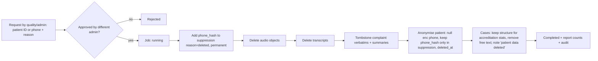

# 07 — Security & Compliance (as product features)

> Not legal advice. Specialist Indian telecom + privacy counsel MUST review before production. The DPDP
> Rules 2025 commencement schedule and current TCCCPR requirements MUST be re-checked at launch
> (OPEN QUESTIONS #1–3).

Framing: every compliance item is a **code path, config flag, or UI control** — not a contract promise.

## 1. Roles & permissions (RBAC)

| Permission | super_admin | admin | quality | dept_owner | read_only |
|---|---|---|---|---|---|
| View queue / cases | all tenants (audited) | ✅ | ✅ | own depts | ✅ (no verbatim) |
| View verbatim / transcript | audited, break-glass reason required | ✅ | ✅ | own depts | ❌ |
| Play audio | break-glass | ✅ | ✅ | ❌ | ❌ |
| Acknowledge / assign / resolve | ❌ | ✅ | ✅ | own depts (ack, start, resolve) | ❌ |
| Close / reopen / merge / invalidate | ❌ | ✅ | ✅ | ❌ | ❌ |
| Human review of safety calls | ❌ | ✅ | ✅ | ❌ | ❌ |
| Upload lists | ❌ | ✅ | ✅ | ❌ | ❌ |
| Account settings, users, survey | ✅ | ✅ | ❌ | ❌ | ❌ |
| Pause calling | ✅ | ✅ | ✅ | ❌ | ❌ |
| Suppression add / check | ❌ | ✅ | ✅ | ❌ | ❌ |
| Deletion request / approve | ❌ | request+approve (not own) | request | ❌ | ❌ |
| Audit log | ✅ | ✅ | ❌ | ❌ | ❌ |
| Cost dashboard | ✅ | ✅ | ❌ | ❌ | ❌ |

Implemented as a permission map in `core/security.py` (`Permission` enum) + FastAPI dependency
`require(Permission.X)`; scoped checks (dept/location) in services. A test enumerates every route and
asserts it declares a permission (no unguarded routes).

## 2. Authentication

- Passwords: argon2id (m=64 MB, t=3, p=4), min 12 chars, zxcvbn ≥ 3, breached-password check against a
  local k-anonymity list (optional).
- MFA TOTP mandatory for admin/super_admin; recovery codes (10, hashed).
- Sessions: JWT access 15 min (EdDSA, key rotation via `kid`), refresh tokens opaque + hashed in DB,
  rotation with reuse detection (reuse → revoke family, alert).
- Lockout policy per doc 06 (PFA-AUTH-003).
- Auth designed so SSO (SAML/OIDC, Phase 2) plugs in as another `IdentityProvider` without schema changes
  (`users.password_hash` nullable, `users.external_idp_subject` added in Phase 2 migration).

## 3. Encryption

| Data | At rest | In transit |
|---|---|---|
| DB volume | Cloud disk encryption (AES-256) | TLS 1.2+ to Postgres (`sslmode=verify-full`) |
| Phone numbers | App-layer AES-256-GCM envelope encryption: per-account DEK wrapped by KMS KEK; `phone_hash` = HMAC-SHA256 with platform pepper in KMS | — |
| Transcripts, verbatims | App-layer AES-256-GCM (same DEK scheme) | — |
| Audio | S3 SSE-KMS, bucket private, per-account prefix, object lock off, lifecycle rule as backstop to retention job | Signed URLs 5 min |
| MFA secrets | App-layer encrypted | — |
| Backups | Encrypted, India region, 30-day retention, restore tested monthly | — |
| All HTTP | HSTS (1 y, includeSubDomains), TLS 1.2+ only | — |
| Media (SIP/RTP) | SRTP/TLS where Plivo↔LiveKit supports; document otherwise in subprocessor note | — |

Key rotation: KEK yearly (KMS automatic); DEK rotation on demand with background re-encrypt job.
Crypto only via `core/security.py` helpers; no ad-hoc crypto elsewhere (lint rule).

## 4. Secrets

- Stored in cloud secret manager; injected as env at runtime. `.env` only for local dev with fake keys.
- `gitleaks` pre-commit + CI. CI fails on any secret pattern.
- Vendor keys scoped minimally (e.g., Plivo sub-account per environment).
- Secrets never logged; settings object `__repr__` masks secret fields.

## 5. Application security controls

| Threat | Control |
|---|---|
| Injection | SQLAlchemy parameterised queries only; raw SQL forbidden outside migrations (lint) |
| XSS | React escaping; no `dangerouslySetInnerHTML`; CSP `default-src 'self'`; verbatims rendered as text |
| CSRF | SameSite=Strict + double-submit token |
| IDOR / cross-tenant | RLS + mandatory `account_id` in repositories + 404 for foreign IDs + tests per endpoint |
| CSV injection | Escape leading `= + - @` on export |
| File upload | Size/row limits, MIME + extension check, parse in worker (not API), no execution |
| SSRF | Outbound HTTP only to allowlisted vendor hosts (egress policy) |
| Webhook spoofing | Plivo signature v3 + nonce + timestamp window 5 min |
| Brute force | Rate limits + lockout |
| Prompt injection via patient speech | LLM outputs are JSON-schema-validated data only; LLM cannot trigger actions directly; banned-content guard on any text spoken; deterministic control of all sensitive transitions |
| Toll fraud / misuse | Dial only numbers from ingested visits; non-prod allowlist; daily caps; anomaly alert on calls/hour |
| Dependency vulns | `pip-audit`, `npm audit`, Dependabot; CI fails on high/critical |
| Container | Distroless/slim images, non-root user, read-only FS, image scanning (Trivy) |
| Security headers | HSTS, CSP, X-Content-Type-Options, Referrer-Policy strict-origin, Permissions-Policy, frame-ancestors 'none' |

## 6. Audit log

Actions that MUST write `audit_log` (same transaction as the change):
login success/failure, MFA changes, user create/role change/deactivate, account setting changes (before/
after), survey activation, batch upload, eligibility review decisions, suppression add/remove, consent
state changes (system actor), opt-out (system actor), case every transition + assign + note,
transcript view, verbatim view, audio play, deletion request/approve/complete, super-admin tenant access,
data export.

Tamper evidence: `row_hash = SHA256(prev_hash || canonical_json(row))`; nightly job verifies the chain and
alerts on break. DB grants: app role INSERT-only. Export (CSV/JSON) in Phase 2; MVP: admin UI view + API.

## 7. DPDP Act 2023 mapping

Roles: **Hospital = Data Fiduciary**, **PFA = Data Processor** acting on documented instructions (DPA).

| Obligation | Product feature |
|---|---|
| Lawful basis / consent | Consent state machine (doc 03 §4.1), persisted per call before any question |
| Clear, plain notice | Fixed opening script, no LLM variation, per-language reviewed text |
| Purpose limitation | `campaign_type`; survey data cannot feed promotional campaigns (DB-level: promotional campaigns disabled in MVP; service refuses cross-campaign reads) |
| Data minimisation | Minimal `patients` table; hashed phone; no clinical fields; verbatims only as volunteered |
| Storage limitation | `retention_until` on every artefact + purge jobs + S3 lifecycle backstop |
| Security safeguards | §3–§6 |
| Withdrawal of consent | In-call withdrawal handler; post-call via hospital → deletion workflow; suppression added |
| Data principal rights (access/correction/erasure) | Hospital-facing workflows: patient data export (call list + transcripts, JSON/PDF — Phase 1 minimal JSON), correction via re-ingest, deletion request (§8) |
| Breach notification | Incident runbook (doc 10 §6): detect → contain → assess → notify fiduciary within contractual window (proposed ≤ 24 h) with facts for their DPB/patient notices |
| Processor contract | DPA template (business deliverable) aligned to: purpose, subprocessors, retention, deletion, breach, audit rights, exit assistance |
| Children | Minors excluded at eligibility (age < 18) |

Treat as personal data: phone numbers, recordings, transcripts, names, appointment details, complaint
content. Assume feedback may reveal health information even if never asked.

## 8. Deletion workflow

SLA: default 7 days from approval (configurable ≤ 30). Job idempotent and resumable; partial failure →
`failed` + auto-retry ×3 + alert. Account-scope deletion (offboarding): export pack to hospital → delete
all tenant data except audit log (retained per contract, then deleted).

## 9. Telecom (TRAI / TCCCPR) as code

| Requirement | Implementation |
|---|---|
| Classification service vs promotional | `campaign_type` first-class; MVP only `service_feedback`; script sets tied to campaign type; promotional requires separate consent state & template (disabled) |
| DND/NCPR filtering | `suppression_list` (platform rows with reason `dnd`), sync job from provider/registry source (OPEN QUESTION #1/#3), `DND_STRICT` default true |
| Registered caller identity | `accounts.caller_id_e164` must be a verified provisioned number; activation blocked otherwise |
| Calling hours | `is_dialable` in code at dial time + pre-dial recheck; test asserts zero out-of-window dials |
| Retry caps | `retry_policy.py`, DB CHECK attempt ≤ 3 |
| Consent records | `calls.consent_state/at`, `audit_log` |
| Complaint handling | Opt-out in-call + dashboard suppression + deletion workflow |
| No marketing reuse | Banned-phrase guard in probe generation; content reuse blocked by campaign separation |

Pre-production checklist (business owner): Plivo India number provisioning, entity registration, DLT
setup, recording arrangement, header/CLI rules.

## 10. Healthcare obligations → product

- Agent never diagnoses, recommends treatment, or interprets symptoms/reports (fixed boundary + guards).
- Escalation engine is part of the hospital's grievance process → accreditation-grade evidence triad:
  `cases` + `case_events` + `audit_log` (who complained/anonymised, verbatim, who acted, when, outcome).
- Doctor-level scores labelled as experience, not clinical quality; min n=5.

## 11. Subprocessors (documented list, shown in Settings → Compliance)

Plivo (telephony), LiveKit (media/agent infra — Cloud or self-hosted), Deepgram (STT), Google Gemini
(LLM), Cartesia (TTS), cloud provider (hosting, KMS, S3), email provider. For each: purpose, data
categories, region, retention at vendor, DPA link. Configure vendor-side **no data retention / no
training** options wherever offered and record that setting.

## 12. Security testing (see doc 08 §7)

SAST (bandit, semgrep), dependency scan, secret scan, container scan, DAST (OWASP ZAP baseline) against
staging, tenant-isolation test suite, authz route matrix test, pre-pilot external pentest (business
decision, recommended).
